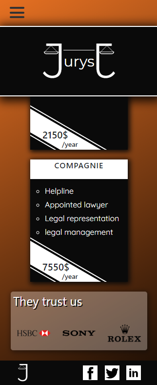
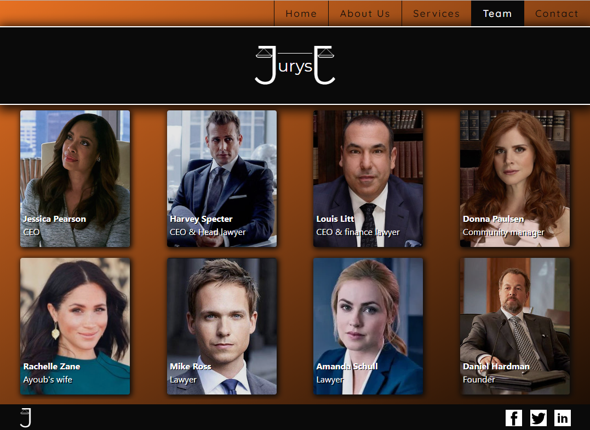

#Projet Bootstrap (Startup)

##Langages utilisés :
- HTML
- CSS
- Javascript

##Description
Ce site présente une start-up fictive sur plusieurs pages.
Il est entièrement responsive et utilise le Grid Bootstrap.

##Avancement
Le projet est terminé.

##ScreenShots

